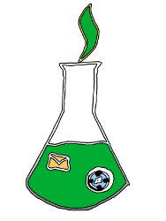
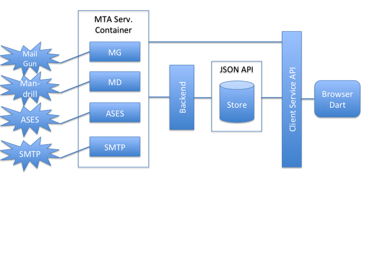

E Mail Service
------------------------------------------------------------

This is now work-in-progress.

Want to get going Fast deploying GeoMail, [Click here](#deploy-testing-build-getting)

 Concept and Design
--------------

The concept intended for this project is GeoMail, the
globally-localized e-mail service. We provide a web-based email
service (e.g. like Gmail) but require that a user offer their
location. Under the catch-line "<b>You have to share to get
anywhere</b>" we reduce our service for users providing no location
information. In addition to an inbox and the ability to compose
e-mails our service (and this is the new thing) presents mailing lists
of people logged in nearby. An example would be a <b>one mile</b> list
allowing the user to send an email to his contacts (people he has
received or send mails to) logged in the range at mile from the
users current location.

On the technical side we provide a web-mail front-end with a back-end
server abstracting any number of MTA-providers like MailGun, Mandrill,
Amazon SeS and SMTP transports. E-mails delivery is ensure by fail-over.
In this way GeoMail is scalable and reliable.

System Design
---------------

#Deploy, Testing, Build, Getting
--------------------
