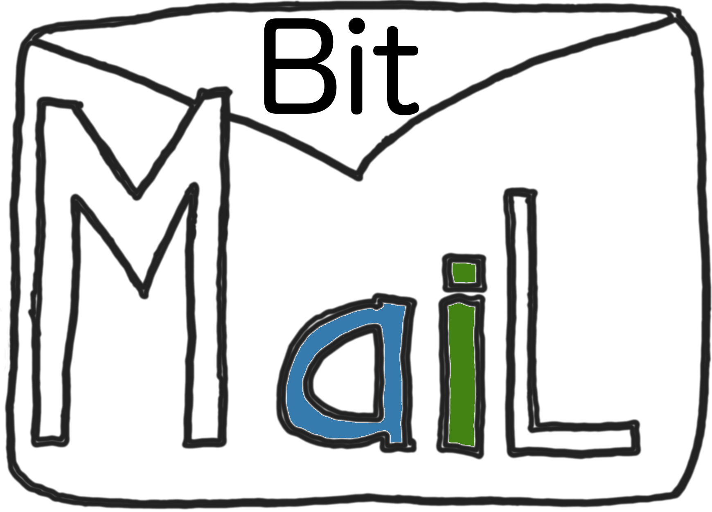

E Mail Service
------------------------------------------------------------

[BitMail Live](https://mail.bitlab.dk) - Try logging in. When a new user logs in
for the first time, (s)he is created.

[Click here](#deploy-test-build-get) to see how the system is built, tested and deployed.


Concept and Design
--------------
This section describes the conceptual idea and the design choices for a scalable 
and reliable e-mail service.

Concept
---
The concept is a high reliable e-mail sending service. The service is a container that employes several 
Mail Transport Agent Providers (MTA Provider). A single point of e-mail submission is offered by the container. When an 
e-mail is submitted to the service it schedules a provider and forwards the e-mail to it. If a transport fails 
one of the other providers is used as fail-over. If no MTA provider is availble the e-mail service logs that 
it is down and terminates entirely.

To provide a way of sending e-mails the system offers a simple web-mail interface over https. 
The interface allows the user to log in and compose e-mails. Multiple recipient are supported by
separating their address with semi-colon.


 Design
---
This is a <b>full stack</b> implementation of an e-mail service using several sending providers. See the 
systems component diagram below. 


The solution is implemented in four tiers divided between a server and a client. Three of the tiers run on the server while 
the final teir is a browser on the client. At back of the server we have the MTAServer which is an application implementing the MTA Container. In the middle is the BackEndServer which handles access to the storage. The front of the server, the ClientAPI, accepts HTTPS connections from browser clients. Server applications are written in the [Go](http://www.golang.org) language while the client is written in [Dart](http://www.dartlang.org) compiled to JavaScript.

An MTA-container runs with multiple MTA-provider-components inside to 
offer a unified API for sending (and receiving) emails. Also, it ensures reliability through 
fail-over if any MTA-provider should have a fall-out. The MTA Container uses a Scheduling strategy for chosing 
which MTA provider it shall employ. By default a Round Robin Scheduler is provided. Performance can be optimized
by providing a custom instance of the Scheduler-strategy interface. For example, one could 
implement an adaptive scheduling strategy sending e-mails according to performance stats (e.g. slow MTAs gets scheduled less often).

The system supports three MTAs for sending e-mail: Amazon SES, MailGun, and Mandrill. 
For MailGun the provider is custom and specialized towards using their comprehensive API
including their <b>WebHooks API</b> for getting <b>health information</b> about sent e-mails and 
also their <b>Routes API</b> is used to get notified when e-mails arrive. 
For Amazon SeS there is also a custom provider mainly using their SendEmail function [Rest API](http://docs.aws.amazon.com/ses/latest/DeveloperGuide/sending-email.html). Both Amazon SeS and MailGun offers
Go-libraries to access their services, while Mandrill does not. The Mandrill provider thus creates the Urls and parses 
the repsonse from the Mandrill End-Point. 

The BackEndServer listens for incoming connections from the ClientAPI (the next teir). It uses the storage for user names and other log in related information when authenticating e-mail send requests. The storage is Json-based. Entries are maps from string to string. The storage offers three operations: put, update, and get. Lookup takes a map from string to string and returns all maps in storage that have the given map as a subset. See [jsonstore.go](https://github.com/rasmuswz/e-mail-service/blob/master/goworkspace/src/mail.bitlab.dk/backend/jsonstore.go) The storage container only supports in memory storage for the time being. A final version should include permanent storage like a Oracle <b>MySQL</b> database to implement the jsonstore. A high-performing solution might employ a file based solution in a High-Perf-Distributed-File-Systems like [Hadoop HDFS](https://hadoop.apache.org/docs/stable/hadoop-project-dist/hadoop-hdfs/HdfsUserGuide.html). The storage is used 

The ClientAPI is a Https-webserver which serves the client. Also, Ajax requests are handled by taking appropriate actions with the BackEndServer and the MTAServer. As an example when a users logs in the ClientAPI queries the BackEndServer to authenticate.  

On the client side a Dart-application renders the user interface. It implements the Model-View-Controller pattern having the View defined in [index.html](https://github.com/rasmuswz/e-mail-service/blob/master/dartworkspace/web/index.html), the Controller defined in [main.dart](https://github.com/rasmuswz/e-mail-service/blob/master/dartworkspace/web/main.dart) and a model defined in [mailmodel.dart](https://github.com/rasmuswz/e-mail-service/blob/master/dartworkspace/web/mailmodel.dart). The model takes a strategy for handing communication with the ClientAPI, see  [ClientAPI](https://github.com/rasmuswz/e-mail-service/blob/master/dartworkspace/web/geoconnection.dart) class.

This design has decoupled components in order to scale well. A deployed instance of the system may include several MTAServers, and ClientApis running on different machines. However, to give a consistent experience a common storage is needed, and therefore all ClientAPIs need access to the same BackEndServer. We do provide a Proxy interface for supplying a [ProxyStore](https://github.com/rasmuswz/e-mail-service/blob/master/goworkspace/src/mail.bitlab.dk/backend/jsonstore.go#L270) where the idea is that one instance will have the actual physical storage while other BackEndServer servers use a Proxy.

Example Deployment
--------------------

To try out the application in practice the domain mail.bitlab.dk has been setup. The domain has been setup to accept email for mail.bitlab.dk and getting mail delivered by MailGun, AmazonSes. The domain is supported by two servers: mail0.bitlab.dk hosted here in Aarhus and mail1.bitlab.dk hosted by Amazon AWS in Oregon west. 

To give an idea how the deployment and build system is setup I invite you to take a tour at the build server. The Start-up-password is required to log-in at the server.

<pre>
ssh ubuntu@dev.bitlab.dk<br/>
cd e-mail-service<br/>
ls <br/>
</pre>
Here you will see this repository checked out. This machine is also setup with SSH-Private keys to allow it to deploy
new version of the software to mail0.bitlab.dk and mail1.bitlab.dk. Try it:

<pre>
fab deploy
</pre>

You will see the Python-tool called [Fabric](http://www.fabfile.org/) running the deploy commands once for each server. 
To get an overview of what it does see [fabfile.py](https://github.com/rasmuswz/e-mail-service/blob/master/fabfile.py). The <b>deploy</b> function near the bottom nicely lays out what is going on :-). The final step in the deployment process is 
killing the existing processes and starting the newly installed ones. The old versions are kept on the servers until someone 
logs-in and manually deletes them.

Is it feature complete?
--------------------
No! Writing a full web-application from scratch is a lot of work. However I think we got far enough to get people excited about this project. Among missing features to have version realizing the concept of Geo Mailing we need:

  * The GeoLists needs to be implemented (we do record user locations upon log in and store them) e.g. when the user clicks on a list in the bottom of the page (like on <b>One Mile (9 Friends)</b>) we need act on that.
  * Each server instance (we deploy on two servers) has its own memory store. E.g. the user will see different data when the DNS server routes them to a different server. Also, incoming emails are stored between the servers at the will of DNS-scheduling.
  * Getting email listed when logged in

Among the thins I am particular proud of are:

  * The MTA Container: GoLang's channels allow us to write a powerful Container aggregating the result from several MTA providers (Amazon SeS, MailGun etc) in to one stream in a concise and precise way. See [DefaultMTAContainer](https://github.com/rasmuswz/e-mail-service/blob/master/goworkspace/src/mail.bitlab.dk/mtacontainer/MTAService.go#L260) lines 273 to 300.
  * The MTA Provider failover stategy: Again the approach of using channels for [Health](https://github.com/rasmuswz/e-mail-service/blob/master/goworkspace/src/mail.bitlab.dk/mtacontainer/MTAService.go#L116) Monitoring of our MTA Container allow us to implement FailOver to a different MTA provier in only [6 lines of Go-code](https://github.com/rasmuswz/e-mail-service/blob/master/goworkspace/src/mail.bitlab.dk/mtacontainer/mtaserver/main.go#L40). Each MTA Provider has a [FailureStrategy](https://github.com/rasmuswz/e-mail-service/blob/master/goworkspace/src/mail.bitlab.dk/mtacontainer/MTAService.go#L56) deciding when an error(s) is severe enough   that an MTA is considered down. We see these components in play for example in the [AmazonSeS MTA Provider](https://github.com/rasmuswz/e-mail-service/blob/master/goworkspace/src/mail.bitlab.dk/mtacontainer/amazonsesprovider/AmazonSeS.go#L137) lines 137 to 148. The MTA Provider sleeps for 2 seconds if an error occurs while submitting an E-mail for sending and the resubmits that email to it self. If this happens alot the [ThresholdFailureStrategy](https://github.com/rasmuswz/e-mail-service/blob/master/goworkspace/src/mail.bitlab.dk/mtacontainer/MTAService.go#L70) employed here will deem the MTA Down for good an notify on the events-channel and shutdown the MTA (lines 145 - 147).
  * Events 

#Deploy, Test, Build, Get
--------------------

Well eager to deploy this project and try it out? [Live Demo](https://mail.bitlab.dk).

Want to do it your self, well we need to Get, Build and optionally run the tests first.

Getting GeoMail
----

Easy just clone this repo.

Preparing your machine
----

You needs a few tools installed for the build for work:

  * Python 2.17
  * pip (to install Fabric do pip install Fabric)
  * Fabric
  * GoLang-SDK 1.5
  * DartLang-SDK ^1.12.1

Experimentally the scripts/bootstrap.sh script tries to get the dependencies right. This has 
only be tested on OSX El Captain, but should work for Linux. 

Building
----
This takes a few easy steps depending on which operating system you are using.

<pre>
e-mail-service$ fab build
</pre>

Notice how <pre>go get</pre> and <pre>pub get</pre> gets all the Go and Dart dependencies. Fabric build it all,
invoking both the Dart and Go build systems as needed. The Fabfile.py is original work coming with this package.

Testing
----
We only have tests of the components written in Go. Try running the Go test suite:
<pre>
e-mail-service$ cd goworkspace && go test
</pre>

Or use Fabric

```
e-mail-service$ fab test
```

Deploying
-----

Easy, this will update the production system at mail.bitlab.dk provided you have
got the SSH-RSA private keys to access the servers.
```
fab deploy_bitlab_servers
```
The ssh-keys needed are avaible in the <pre>demo@dev.bitlab.dk:.ssh/ec2key.pem</pre> file on the 
test development environment. As stated above you can login with <pre>demo@dev.bitlab.dk</pre> using
the Start-up-passphrase given in submission note.
