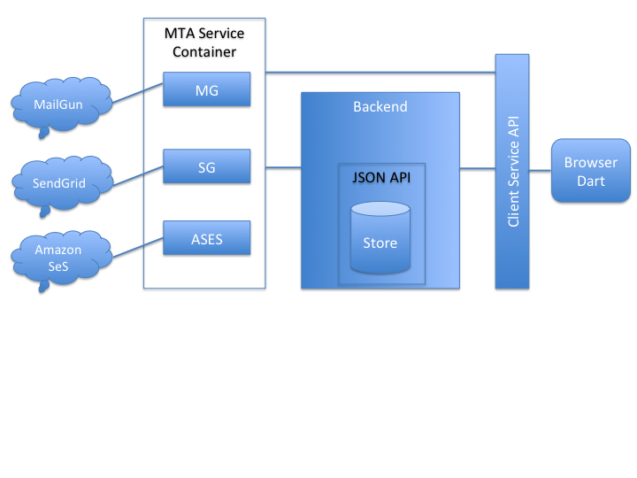

E Mail Service
------------------------------------------------------------


[GeoMail Live](https://mail.bitlab.dk) - Try logging in, if a non existing user logs in
for the first time, (s)he is created.

[Click here](#deploy-test-build-get) - To see how the system is built, tested and deployed.


Concept and Design
--------------
This section describes the conceptual idea and the design choices for a scalable 
and reliable service.

Concept
---
The concept intended for this project is GeoMail, the
globally-localized e-mail service. We provide a web-based email
service (e.g. like Gmail) but require that users offer their
location upon log-in. The idea is that "<b>You have to share to get
anywhere</b>" in this case it is your position. In addition to an in-box and the ability to compose
e-mails the service (and this is the new thing) presents mailing lists
of people logged in nearby. An example would be a <b>one mile</b> list
allowing the user to send an email to his contacts (people he has
received or send mails to) logged in with in a range of one mile from the
users current location.

 Design
---
This is a <b>full stack</b> implementation of e-mail service using several sending providers. See the 
systems component diagram below. I provide a <b>web-mail front-end</b> with a back-end
server <b>abstracting any number</b> of MTA-providers like MailGun, Mandrill,
Amazon SeS and SMTP transports. 

An MTA-container runs with multiple MTA-provider-components inside to 
offers a <b>unified API</b> for <i>sending</i> and <i>receiving</i> emails. Also, it ensures reliability through 
fail-over if <i>any</i> MTA-provider should have a fall-out. Wrt. performance it can be optimized by providing a custom instance of the <b>Scheduler</b>-strategy interface; by default we provide an out of the Box Round Robin Scheduler. One could 
implement an adaptive scheduling strategy sending e-mails according to performance stats (e.g. slow MTAs gets scheduled less often).

We provide a <b>Custom</b> provider for MailGun that is specialized towards using their comprehensive API
including their <b>WebHooks API</b>  for getting <b>health information</b> about sent e-mails and 
also we use their <b>Routes API</b> to get notified when e-mails arrive. 

We provide a <Custom</b> provider for <b>Amazon SeS</b> using their [Rest API](http://docs.aws.amazon.com/ses/latest/DeveloperGuide/sending-email.html). 

To store e-mails for users INBOXes we define a storage container having a <b>REST-based JSon API</b>. The storage 
contains entries that are of the type: map[string]string or Map<String,String>. An entry is added by providing a map
from string to string. A list of entries can be looked up by providing a matching-map and all records having the keys with
the same values as in the matching map will be return. Finally one can update an entry by given a matching map and a new-values-map and then all entries matching the matching map will have their entries with keys in the new-values-map updated.
See [jsonstore.go](https://github.com/rasmuswz/e-mail-service/blob/master/goworkspace/src/mail.bitlab.dk/backend/jsonstore.go)
Our storage container only supports in memory storage for the time being. A final version should include permanent storage like a Oracle <b>MySQL</b> database to implement the <i>jsonstore</i>. A high-performing solution might employ a file based solution in a High-Perf-Distributed-File-Systems like [Hadoop HDFS](https://hadoop.apache.org/docs/stable/hadoop-project-dist/hadoop-hdfs/HdfsUserGuide.html).

The solution is implemented as three server applications: MTAserver, Backendserver and ClientAPI. The MTA server 
manages the MTA providers and provides a REST API for sending emails. The MTA server also receives e-emails and 
invokes a End-point on the BackEnd-Server when an email has arrived. 

The BackEndServer listens for the MTA Container to deliver email, and stores those received in the jsonstore. Also it listens for the ClientAPI to query INBOX e-mails.

The ClientAPI is a Https-webserver. It serves the build/web folder of a compiled Dart-application which runs on users browsers. The Dart-application uses AJax under the hood to call functionality back on the ClientAPI which in turn forwards requests to the BackEndServer (querying INBOX) and the MTAContainer (sending emails).

This design is scalable in the sense that it supports adding multiple BackEndServers, MTA Containers and ClientAPIs. They all need to have access to a common store and the software is prepared for that by supplying a [ProxyStore](https://github.com/rasmuswz/e-mail-service/blob/master/goworkspace/src/mail.bitlab.dk/backend/jsonstore.go#L270) which is not implemented yet but the idea is that one instance will have an actual physical store while other servers implements the Proxy.


The Dart browser application implements the Model-View-Controller pattern having the View defined in [index.html](https://github.com/rasmuswz/e-mail-service/blob/master/dartworkspace/web/index.html), the Controller defined in [main.dart](https://github.com/rasmuswz/e-mail-service/blob/master/dartworkspace/web/main.dart) and a model defined in [mailmodel.dart](https://github.com/rasmuswz/e-mail-service/blob/master/dartworkspace/web/mailmodel.dart). The mailmodel.dadrt takes a strategy for 
handing communication with the ClientAPI, the browser side [ClientAPI](https://github.com/rasmuswz/e-mail-service/blob/master/dartworkspace/web/geoconnection.dart) class.

Example Deployment
--------------------

To try out the application in practice the domain mail.bitlab.dk has been setup. The domain has been setup to accept email for mail.bitlab.dk and getting mail delivered by MailGun, AmazonSes. The domain is supported by two servers: mail0.bitlab.dk hosted here in Aarhus and mail1.bitlab.dk hosted by Amazon AWS in Oregon west. 

To give an idea how the deployment and build system is setup I invite you to take a tour at the build server. The Start-up-password is required to log-in at the server.

<pre>
ssh ubuntu@dev.bitlab.dk<br/>
cd e-mail-service<br/>
ls <br/>
</pre>
Here you will see this repository checked out. This machine is also setup with SSH-Private keys to allow it to deploy
new version of the software to mail0.bitlab.dk and mail1.bitlab.dk. Try it:

<pre>
fab deploy
</pre>

You will see the Python-tool called [Fabric](http://www.fabfile.org/) running the deploy commands once for each server. 
To get an overview of what it does see [fabfile.py](https://github.com/rasmuswz/e-mail-service/blob/master/fabfile.py). The <b>deploy</b> function near the bottom nicely lays out what is going on :-). The final step in the deployment process is 
killing the existing processes and starting the newly installed ones. The old versions are kept on the servers until someone 
logs-in and manually deletes them.

Is it feature complete?
--------------------
No! Writing a full web-application from scratch is a lot of work. However I think we got far enough to get people excited about this project. Among missing features to have version realizing the concept of Geo Mailing we need:

  * The GeoLists needs to be implemented (we do record user locations upon log in and store them) e.g. when the user clicks on a list in the bottom of the page (like on <b>One Mile (9 Friends)</b>) we need act on that.
  * Each server instance (we deploy on two servers) has its own memory store. E.g. the user will see different data when the DNS server routes them to a different server. Also, incoming emails are stored between the servers at the will of DNS-scheduling.
  * Getting email listed when logged in

Among the thins I am particular proud of are:

  * The MTA Container: GoLang's channels allow us to write a powerful Container aggregating the result from several MTA providers (Amazon SeS, MailGun etc) in to one stream in a concise and precise way. See [DefaultMTAContainer](https://github.com/rasmuswz/e-mail-service/blob/master/goworkspace/src/mail.bitlab.dk/mtacontainer/MTAService.go#L260) lines 273 to 300.
  * The MTA Provider failover stategy: Again the approach of using channels for [Health](https://github.com/rasmuswz/e-mail-service/blob/master/goworkspace/src/mail.bitlab.dk/mtacontainer/MTAService.go#L116) Monitoring of our MTA Container allow us to implement FailOver to a different MTA provier in only [6 lines of Go-code](https://github.com/rasmuswz/e-mail-service/blob/master/goworkspace/src/mail.bitlab.dk/mtacontainer/mtaserver/main.go#L40). Each MTA Provider has a [FailureStrategy](https://github.com/rasmuswz/e-mail-service/blob/master/goworkspace/src/mail.bitlab.dk/mtacontainer/MTAService.go#L56) deciding when an error(s) is severe enough   that an MTA is considered down. We see these components in play for example in the [AmazonSeS MTA Provider](https://github.com/rasmuswz/e-mail-service/blob/master/goworkspace/src/mail.bitlab.dk/mtacontainer/amazonsesprovider/AmazonSeS.go#L137) lines 137 to 148. The MTA Provider sleeps for 2 seconds if an error occurs while submitting an E-mail for sending and the resubmits that email to it self. If this happens alot the [ThresholdFailureStrategy](https://github.com/rasmuswz/e-mail-service/blob/master/goworkspace/src/mail.bitlab.dk/mtacontainer/MTAService.go#L70) employed here will deem the MTA Down for good an notify on the events-channel and shutdown the MTA (lines 145 - 147).
  * Events 

#Deploy, Test, Build, Get
--------------------

Well eager to deploy this project and try it out? [Live Demo](https://mail.bitlab.dk).

Want to do it your self, well we need to Get, Build and optionally run the tests first.

Getting GeoMail
----

Easy just clone this repo.

Preparing your machine
----

You needs a few tools installed for the build for work:

  * Python 2.17
  * pip (to install Fabric do pip install Fabric)
  * Fabric
  * GoLang-SDK 1.5
  * DartLang-SDK ^1.12.1

Experimentally the scripts/bootstrap.sh script tries to get the dependencies right. This has 
only be tested on OSX El Captain, but should work for Linux. 

Building
----
This takes a few easy steps depending on which operating system you are using.

<pre>
e-mail-service$ fab build
</pre>

Notice how <pre>go get</pre> and <pre>pub get</pre> gets all the Go and Dart dependencies. Fabric build it all,
invoking both the Dart and Go build systems as needed. The Fabfile.py is original work coming with this package.

Testing
----
We only have tests of the components written in Go. Try running the Go test suite:
<pre>
e-mail-service$ cd goworkspace && go test
</pre>

Or use Fabric

```
e-mail-service$ fab test
```

Deploying
-----

Easy, this will update the production system at mail.bitlab.dk provided you have
got the SSH-RSA private keys to access the servers.
```
fab deploy_bitlab_servers
```
The ssh-keys needed are avaible in the <pre>demo@dev.bitlab.dk:.ssh/ec2key.pem</pre> file on the 
test development environment. As stated above you can login with <pre>demo@dev.bitlab.dk</pre> using
the Start-up-passphrase given in submission note.
